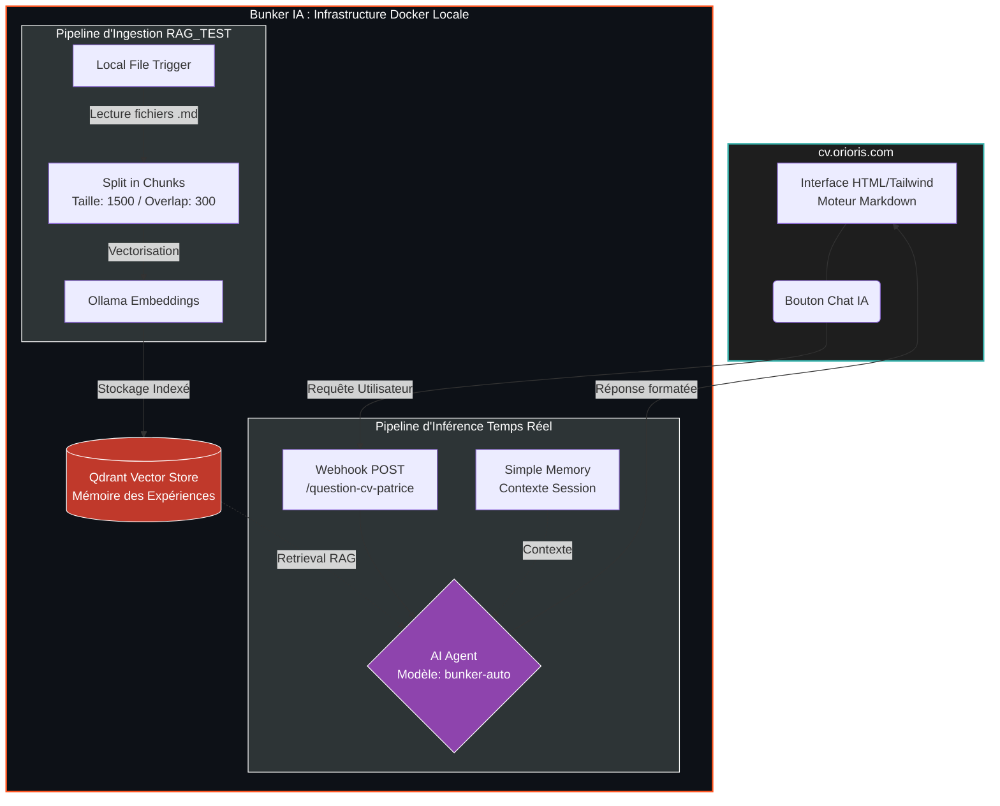

  
  
  <h1>ORIORIS | CV Interactif & Clone Numérique</h1>
  
  
<b>Démonstrateur Technique : Agent IA conversationnel couplé à une base vectorielle locale (RAG).</b>

  

    
    
    
    
  

---

## 🚀 Le Projet : "Answer Engine" B2B & Cyber

Ce dépôt héberge mon CV numérique, mais sa véritable valeur réside dans son **infrastructure**. 
Après 20 ans d'expérience dans le déploiement logiciel B2B et la gestion de comptes stratégiques, ma transition vers la Cybersécurité (AIS) s'accompagne d'une exigence : la souveraineté des données.

Ce projet démontre ma capacité à concevoir un **système de Retrieval-Augmented Generation (RAG) 100% local et sécurisé**, intégré à une interface web fluide pour interagir avec les recruteurs.

---

## 🏗️ Architecture Logique (VSL)

Le système est divisé en deux pipelines distincts orchestrés par n8n :
1. **L'Ingestion (Asynchrone) :** Traitement des fichiers locaux, découpage sémantique et vectorisation.
2. **L'Inférence (Temps Réel) :** L'interface web interroge l'agent qui croise la mémoire (Vector Store) avec le LLM.

---
## 📂 Contenu du Dépôt 

index.html : Interface principale avec design monolithique et intégration de Tailwind CSS. Contient le script asynchrone de connexion au webhook n8n, la gestion du statut de l'IA et le parsing Markdown des réponses.

Les notes documentaires (format Obsidian) décrivant l'ingénierie des flux n8n :

♾️Agent CV - Patrice Vayne.md : Documentation du workflow question-cv-patrice. Définit l'agent conversationnel, sa mémoire de session et sa connexion au LLM bunker-auto.

♾️Pipeline d'Ingestion RAG (RAG_TEST).md : Documentation de l'automate d'alimentation. Surveille les fichiers, les découpe (chunks) et les stocke dans Qdrant.

## ⚙️ Mécanique Interne & Sécurité

Souveraineté : Le système de chat n'appelle pas directement des API publiques (OpenAI/Anthropic). Il passe par un routeur interne (litellm_bunker) qui permet de basculer instantanément sur des modèles open-source locaux (Mistral, Llama 3) via Ollama en cas de besoin.

Vectorisation Contrôlée : Le chunking est calibré manuellement (1500 tokens / overlap 300) pour garantir que le contexte renvoyé à l'agent lors des requêtes métier (ex: "Quelles sont ses compétences en CAD/CRM ?") soit pertinent et sans hallucination.

Design VSL (Visual Spatial Learning) : Le code frontend est optimisé pour une charge cognitive minimale, avec un parsing Markdown immédiat des réponses de l'IA.
