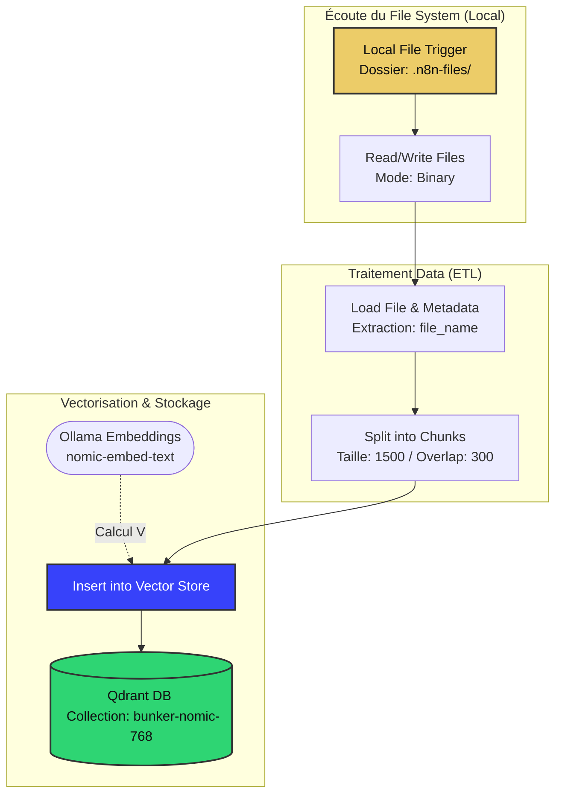

# ♾️ Pipeline d'Ingestion RAG (RAG_TEST)

## 🎯 Objectif Principal (Focus)

> **Résumé**
> Automate d'alimentation de la mémoire de l'Agent. Il surveille le dossier local, lit les fichiers, les découpe sémantiquement (chunks de 1500), les vectorise via Ollama et les stocke dans Qdrant. **Statut : Opérationnel (3 notes fondatrices indexées).**

---

## 🏗️ Architecture Logique (VSL)



## 🧩 Composants Techniques (Stack)

1. Entrées & Sorties
 - Déclencheur (Trigger) : Local File Trigger (/home/node/.n8n-files/). Écoute les événements add et change avec un polling actif.
 - Point de Sortie (Output) : Qdrant Vector Store (Mode insert).
   
2. Moteur Cognitif
 - Modèle d'Embedding : nomic-embed-text:latest (Exécuté en local via Ollama).
 - Stratégie de découpage : Recursive Character Text Splitter (1500 caractères, chevauchement de 300 pour maintenir le contexte inter-paragraphes).

3. Connexions Externes & Bases
  - Outil : Read/Write Files from Disk
  - Outil : Load File Content & Metadata (Conversion Binaire -> Texte)
  - Base Vectorielle : Qdrant (Collection : bunker-nomic-768 | Batch Size : 50)

---


## 📦 Sauvegarde Technique (Le Code)JSON{
  
 ```json 
  "nodes": [
    {
      "parameters": {
        "triggerOn": "folder",
        "path": "/home/node/.n8n-files/",
        "events": ["add", "change"],
        "options": {
          "usePolling": true
        }
      },
      "type": "n8n-nodes-base.localFileTrigger",
      "typeVersion": 1,
      "position": [240, 720],
      "name": "Local File Trigger1"
    },
    {
      "parameters": {
        "mode": "insert",
        "qdrantCollection": {
          "__rl": true,
          "value": "bunker-nomic-768",
          "mode": "id"
        },
        "embeddingBatchSize": 50,
        "options": {}
      },
      "name": "Insert into Vector Store",
      "type": "@n8n/n8n-nodes-langchain.vectorStoreQdrant",
      "position": [656, 656],
      "typeVersion": 1.3
    },
    {
      "parameters": {
        "dataType": "binary",
        "textSplittingMode": "custom",
        "options": {
          "metadata": {
            "metadataValues": [
              {
                "name": "file_name",
                "value": "={{ $json.name }}"
              }
            ]
          }
        }
      },
      "name": "Load File Content & Metadata",
      "type": "@n8n/n8n-nodes-langchain.documentDefaultDataLoader",
      "position": [720, 1008],
      "typeVersion": 1.1
    },
    {
      "parameters": {
        "chunkSize": 1500,
        "chunkOverlap": 300,
        "options": {}
      },
      "name": "Split into Chunks",
      "type": "@n8n/n8n-nodes-langchain.textSplitterRecursiveCharacterTextSplitter",
      "position": [720, 1200],
      "typeVersion": 1
    },
    {
      "parameters": {
        "model": "nomic-embed-text:latest"
      },
      "type": "@n8n/n8n-nodes-langchain.embeddingsOllama",
      "typeVersion": 1,
      "position": [560, 944],
      "name": "Embeddings Ollama1"
    },
    {
      "parameters": {
        "fileSelector": "={{ $json.path }}",
        "options": {}
      },
      "type": "n8n-nodes-base.readWriteFile",
      "typeVersion": 1.1,
      "position": [400, 720],
      "name": "Read/Write Files from Disk1"
    }
  ],
  "connections": {
    "Local File Trigger1": {
      "main": [
        [
          {
            "node": "Read/Write Files from Disk1",
            "type": "main",
            "index": 0
          }
        ]
      ]
    },
    "Load File Content & Metadata": {
      "ai_document": [
        [
          {
            "node": "Insert into Vector Store",
            "type": "ai_document",
            "index": 0
          }
        ]
      ]
    },
    "Split into Chunks": {
      "ai_textSplitter": [
        [
          {
            "node": "Load File Content & Metadata",
            "type": "ai_textSplitter",
            "index": 0
          }
        ]
      ]
    },
    "Embeddings Ollama1": {
      "ai_embedding": [
        [
          {
            "node": "Insert into Vector Store",
            "type": "ai_embedding",
            "index": 0
          }
        ]
      ]
    },
    "Read/Write Files from Disk1": {
      "main": [
        [
          {
            "node": "Insert into Vector Store",
            "type": "main",
            "index": 0
          }
        ]
      ]
    }
  },
  "pinData": {}
```
